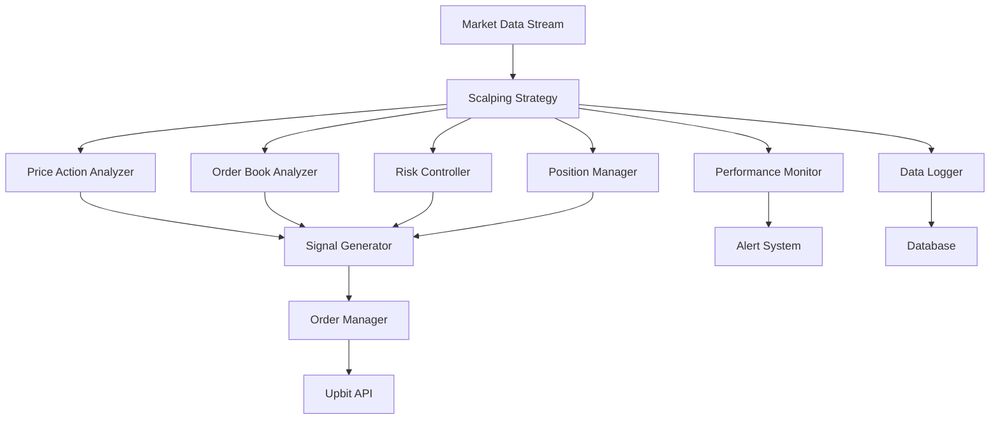

# 스캘핑 매매 전략 설계 문서

## 개요

스캘핑 전략은 업비트 거래봇에 초단기 고빈도 매매 기능을 추가하는 전략입니다. 이 전략은 매우 짧은 시간 프레임(1분 이하)에서 작은 가격 변동을 포착하여 0.1-0.5% 범위의 작은 수익을 반복적으로 획득하는 것을 목표로 합니다. 기존 TradingStrategy 인터페이스를 구현하면서도 스캘핑에 특화된 고유한 기능들을 제공합니다.

## 아키텍처

### 전체 시스템 구조



### 핵심 컴포넌트

1. **ScalpingStrategy**: 메인 전략 클래스
2. **PriceActionAnalyzer**: 가격 패턴 분석
3. **OrderBookAnalyzer**: 호가창 분석
4. **RiskController**: 스캘핑 전용 리스크 관리
5. **PositionManager**: 빠른 포지션 관리
6. **PerformanceMonitor**: 실시간 성과 모니터링

## 컴포넌트 및 인터페이스

### ScalpingStrategy 클래스

```python
class ScalpingStrategy(TradingStrategy):
    """스캘핑 전략 메인 클래스"""
    
    def __init__(self, strategy_id: str, config: Dict[str, Any])
    def evaluate(self, market_data: MarketData) -> Optional[TradingSignal]
    def get_required_history_length(self) -> int
    def _analyze_price_action(self, prices: List[float]) -> Dict[str, float]
    def _analyze_order_book(self, order_book: OrderBook) -> Dict[str, float]
    def _calculate_volatility(self, prices: List[float]) -> float
    def _detect_momentum(self, prices: List[float], volumes: List[float]) -> float
```

### PriceActionAnalyzer 클래스

```python
class PriceActionAnalyzer:
    """가격 액션 패턴 분석기"""
    
    def analyze_patterns(self, candles: List[Candle]) -> Dict[str, float]
    def detect_breakout(self, prices: List[float], volumes: List[float]) -> Optional[BreakoutSignal]
    def calculate_support_resistance(self, prices: List[float]) -> Tuple[float, float]
    def measure_trend_strength(self, prices: List[float]) -> float
```

### OrderBookAnalyzer 클래스

```python
class OrderBookAnalyzer:
    """호가창 분석기"""
    
    def calculate_spread(self, order_book: OrderBook) -> float
    def analyze_depth(self, order_book: OrderBook) -> Dict[str, float]
    def detect_imbalance(self, order_book: OrderBook) -> float
    def calculate_liquidity_score(self, order_book: OrderBook) -> float
```

### RiskController 클래스

```python
class RiskController:
    """스캘핑 전용 리스크 관리"""
    
    def validate_position_size(self, size: float, total_balance: float) -> float
    def check_consecutive_losses(self, trade_history: List[Trade]) -> bool
    def check_daily_loss_limit(self, daily_pnl: float) -> bool
    def check_max_holding_time(self, position: Position) -> bool
    def check_volatility_threshold(self, volatility: float) -> bool
```

## 데이터 모델

### 새로운 데이터 구조

```python
@dataclass
class OrderBook:
    """호가창 데이터"""
    market: str
    timestamp: datetime
    bids: List[Tuple[float, float]]  # (price, volume)
    asks: List[Tuple[float, float]]  # (price, volume)
    
@dataclass
class Candle:
    """캔들스틱 데이터"""
    market: str
    timestamp: datetime
    open_price: float
    high_price: float
    low_price: float
    close_price: float
    volume: float
    
@dataclass
class BreakoutSignal:
    """돌파 신호"""
    direction: str  # 'up' or 'down'
    strength: float
    price_level: float
    volume_confirmation: bool
    
@dataclass
class ScalpingSignal(TradingSignal):
    """스캘핑 전용 거래 신호"""
    target_profit: float
    stop_loss: float
    max_holding_time: int  # seconds
    order_book_score: float
    price_action_score: float
```

## 정확성 속성

*속성은 시스템이 모든 유효한 실행에서 참이어야 하는 특성이나 동작입니다. 속성은 사람이 읽을 수 있는 명세와 기계가 검증할 수 있는 정확성 보장 사이의 다리 역할을 합니다.*

### 속성 1: 시간 프레임 준수
*모든* 스캘핑 전략 실행에 대해, 전략이 활성화되면 평가 주기가 60초 이하여야 한다
**검증: 요구사항 1.1**

### 속성 2: 수익 목표 범위 준수
*모든* 매수 신호에 대해, 목표 수익률이 0.1% 이상 0.5% 이하 범위에 있어야 한다
**검증: 요구사항 1.2**

### 속성 3: 목표 수익률 도달 시 매도
*모든* 활성 포지션에 대해, 현재 수익률이 목표 수익률에 도달하면 매도 신호가 생성되어야 한다
**검증: 요구사항 1.3**

### 속성 4: 손절매 수준 도달 시 청산
*모든* 활성 포지션에 대해, 현재 손실이 손절매 수준에 도달하면 청산 신호가 생성되어야 한다
**검증: 요구사항 1.4**

### 속성 5: 거래량 필터링
*모든* 시장 데이터에 대해, 거래량이 최소 임계값 미만이면 거래 신호가 생성되지 않아야 한다
**검증: 요구사항 1.5**

### 속성 6: 포지션 크기 제한
*모든* 포지션 요청에 대해, 포지션 크기가 총 자산의 5%를 초과하지 않아야 한다
**검증: 요구사항 2.1**

### 속성 7: 연속 손실 제한
*모든* 거래 결과 시퀀스에 대해, 3회 연속 손실 발생 시 전략 실행이 중단되어야 한다
**검증: 요구사항 2.2**

### 속성 8: 일일 손실 한도
*모든* 일일 거래에 대해, 일일 손실이 설정된 한도를 초과하면 거래가 중단되어야 한다
**검증: 요구사항 2.3**

### 속성 9: 최대 보유 시간 제한
*모든* 포지션에 대해, 보유 시간이 최대 허용 시간을 초과하면 강제 청산이 실행되어야 한다
**검증: 요구사항 2.4**

### 속성 10: 변동성 임계값 관리
*모든* 시장 변동성 데이터에 대해, 변동성이 임계값을 초과하면 전략 실행이 중단되어야 한다
**검증: 요구사항 2.5**

### 속성 11: 호가창 분석 정확성
*모든* 호가창 데이터에 대해, 스프레드와 호가 깊이가 올바르게 계산되어야 한다
**검증: 요구사항 3.2**

### 속성 12: 패턴 신뢰도 계산
*모든* 가격 패턴에 대해, 패턴 감지 시 신뢰도가 0과 1 사이의 값으로 계산되어야 한다
**검증: 요구사항 3.3**

### 속성 13: 모멘텀 지표 업데이트
*모든* 거래량 급증 이벤트에 대해, 모멘텀 지표가 올바르게 업데이트되어야 한다
**검증: 요구사항 3.4**

### 속성 14: 지표 유효성 검증
*모든* 기술적 지표 계산에 대해, 계산된 지표 값이 유효한 범위에 있어야 한다
**검증: 요구사항 3.5**

### 속성 15: 수익률 계산 정확성
*모든* 거래 체결에 대해, 수익률과 손익이 올바르게 계산되어야 한다
**검증: 요구사항 4.1**

### 속성 16: 성과 지표 기록
*모든* 거래 결과 시퀀스에 대해, 승률, 평균 수익률, 최대 손실이 올바르게 계산되고 기록되어야 한다
**검증: 요구사항 4.2**

### 속성 17: 비정상 패턴 알림
*모든* 비정상 시장 패턴에 대해, 패턴 감지 시 경고 알림이 생성되어야 한다
**검증: 요구사항 4.3**

### 속성 18: 파라미터 변경 적용
*모든* 파라미터 변경에 대해, 변경사항이 즉시 전략에 적용되어야 한다
**검증: 요구사항 4.4**

### 속성 19: 전략 독립성
*모든* 다중 전략 실행에 대해, 각 전략이 독립적인 포지션 관리를 수행해야 한다
**검증: 요구사항 5.2**

### 속성 20: 충돌 해결
*모든* 전략 간 충돌 상황에 대해, 우선순위 규칙에 따라 올바르게 처리되어야 한다
**검증: 요구사항 5.3**

### 속성 21: 리소스 최적화
*모든* 리소스 부족 상황에 대해, 성능 최적화 모드로 올바르게 전환되어야 한다
**검증: 요구사항 5.4**

### 속성 22: 설정 유효성 검증
*모든* 전략 설정에 대해, 로드 시 유효성이 올바르게 검증되어야 한다
**검증: 요구사항 5.5**

### 속성 23: 신호 생성 로깅
*모든* 거래 신호 생성에 대해, 신호 생성 근거와 지표 값이 로깅되어야 한다
**검증: 요구사항 6.1**

### 속성 24: 포지션 변경 기록
*모든* 포지션 변경에 대해, 변경 사유와 시점이 기록되어야 한다
**검증: 요구사항 6.2**

### 속성 25: 리스크 이벤트 저장
*모든* 리스크 이벤트에 대해, 이벤트 상세 정보가 저장되어야 한다
**검증: 요구사항 6.3**

### 속성 26: 성과 지표 저장
*모든* 성과 지표 계산에 대해, 계산 과정과 결과가 데이터베이스에 저장되어야 한다
**검증: 요구사항 6.4**

## 오류 처리

### 오류 유형 및 처리 전략

1. **시장 데이터 오류**
   - 불완전한 틱 데이터: 이전 데이터로 보간
   - 호가창 데이터 누락: 거래 신호 생성 중단
   - 네트워크 지연: 타임아웃 설정 및 재시도

2. **전략 실행 오류**
   - 지표 계산 실패: 기본값 사용 또는 신호 생성 중단
   - 메모리 부족: 성능 최적화 모드 전환
   - CPU 과부하: 평가 주기 조정

3. **리스크 관리 오류**
   - 포지션 크기 초과: 자동 조정
   - 손절매 실패: 강제 청산
   - 연속 손실 한도 초과: 전략 중단

4. **데이터 저장 오류**
   - 데이터베이스 연결 실패: 로컬 캐시 사용
   - 로그 파일 쓰기 실패: 메모리 버퍼 사용
   - 백업 실패: 알림 생성

## 테스트 전략

### 이중 테스트 접근법

스캘핑 전략은 단위 테스트와 속성 기반 테스트를 모두 사용하여 포괄적인 테스트 커버리지를 제공합니다:

- **단위 테스트**: 특정 예시, 엣지 케이스, 오류 조건을 검증
- **속성 기반 테스트**: 모든 입력에 대해 성립해야 하는 범용 속성을 검증

### 단위 테스트 요구사항

단위 테스트는 다음을 다룹니다:
- 특정 시장 조건에서의 신호 생성 예시
- 컴포넌트 간 통합 지점
- 단위 테스트는 도움이 되지만 너무 많이 작성하지 않습니다
- 속성 기반 테스트가 많은 입력을 처리하는 역할을 담당합니다

### 속성 기반 테스트 요구사항

속성 기반 테스트 라이브러리로 **Hypothesis**를 사용합니다. 각 속성 기반 테스트는 최소 100회 반복 실행되도록 설정합니다.

각 속성 기반 테스트는 설계 문서의 정확성 속성을 구현하는 단일 속성 기반 테스트로 구현되어야 합니다.

각 속성 기반 테스트는 다음 형식으로 설계 문서의 정확성 속성을 명시적으로 참조하는 주석을 포함해야 합니다: '**Feature: scalping-strategy, Property {number}: {property_text}**'

### 테스트 생성기 설계

속성 기반 테스트를 위한 스마트 생성기를 작성하여 입력 공간을 지능적으로 제한합니다:

- **시장 데이터 생성기**: 현실적인 가격 변동과 거래량 패턴
- **호가창 생성기**: 유효한 매수/매도 호가 구조
- **포지션 생성기**: 실제 거래 시나리오를 반영하는 포지션 데이터
- **설정 생성기**: 유효한 전략 파라미터 조합

### 테스트 실행 지침

- 테스트는 실제 기능을 검증해야 하며, 테스트를 통과시키기 위해 모킹이나 가짜 데이터를 사용하지 않습니다
- 테스트가 코드의 버그를 발견할 수 있으며, 코드가 항상 올바르다고 가정하지 않습니다
- 테스트가 명세나 설계 문서에서 다루지 않는 혼란스러운 동작을 발견하면 사용자에게 명확화를 요청합니다
- 작업을 완료하기 전에 모든 테스트가 통과해야 합니다

이 이중 접근법은 단위 테스트가 구체적인 버그를 잡고 속성 테스트가 일반적인 정확성을 검증하는 포괄적인 커버리지를 보장합니다.