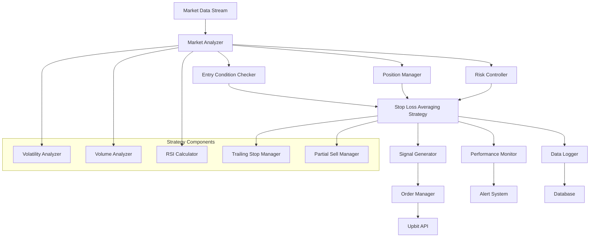

# 손절-물타기 스캘핑 전략 설계 문서

## 개요

손절-물타기 스캘핑 전략은 업비트 거래봇에 리스크 관리와 수익 극대화를 결합한 고도화된 매매 전략을 제공합니다. 이 전략은 -3% 손절선과 -1% 물타기 매수를 통해 리스크를 관리하면서, 변동성이 높은 코인에서 수수료를 고려한 실질적인 수익을 확보하는 것을 목표로 합니다. 

핵심 특징:
- 스마트한 진입 조건 (변동성, 거래량, RSI 기반)
- 단계별 리스크 관리 (물타기 → 손절)
- 부분 매도와 트레일링 스톱을 통한 수익 극대화
- 시장 상황에 따른 적응적 전략 중단

## 아키텍처

### 전체 시스템 구조



### 핵심 컴포넌트

1. **StopLossAveragingStrategy**: 메인 전략 클래스
2. **MarketAnalyzer**: 시장 상황 분석 (변동성, 거래량, RSI)
3. **EntryConditionChecker**: 진입 조건 검증
4. **PositionManager**: 포지션 상태 및 평균 단가 관리
5. **RiskController**: 리스크 관리 및 전략 중단
6. **PartialSellManager**: 부분 매도 관리
7. **TrailingStopManager**: 트레일링 스톱 관리

## 컴포넌트 및 인터페이스

### StopLossAveragingStrategy 클래스

```python
class StopLossAveragingStrategy(TradingStrategy):
    """손절-물타기 스캘핑 전략 메인 클래스"""
    
    def __init__(self, strategy_id: str, config: Dict[str, Any])
    def evaluate(self, market_data: MarketData) -> Optional[TradingSignal]
    def get_required_history_length(self) -> int
    def _check_entry_conditions(self, market_data: MarketData) -> bool
    def _should_average_down(self, current_price: float) -> bool
    def _should_stop_loss(self, current_price: float) -> bool
    def _should_take_profit(self, current_price: float) -> bool
    def _calculate_position_pnl(self, current_price: float) -> float
```

### MarketAnalyzer 클래스

```python
class MarketAnalyzer:
    """시장 상황 분석기"""
    
    def calculate_24h_volatility(self, market_data: MarketData) -> float
    def calculate_volume_ratio(self, market_data: MarketData) -> float
    def calculate_rsi(self, prices: List[float], period: int = 14) -> float
    def detect_rapid_decline(self, market_data: MarketData) -> bool
    def check_market_trend(self, market_data: MarketData) -> str  # 'bullish', 'bearish', 'neutral'
```

### PositionManager 클래스

```python
class PositionManager:
    """포지션 상태 및 평균 단가 관리"""
    
    def __init__(self)
    def add_position(self, price: float, quantity: float, order_type: str)
    def get_average_price(self) -> float
    def get_total_quantity(self) -> float
    def get_position_value(self, current_price: float) -> float
    def calculate_pnl(self, current_price: float) -> Tuple[float, float]  # (amount, percentage)
    def partial_sell(self, quantity: float, price: float) -> None
    def clear_position(self) -> None
    def get_position_status(self) -> Dict[str, Any]
```

### RiskController 클래스

```python
class RiskController:
    """리스크 관리 및 전략 제어"""
    
    def check_daily_loss_limit(self, current_loss: float) -> bool
    def check_consecutive_losses(self, trade_history: List[Trade]) -> bool
    def check_account_balance(self, balance: float, min_balance: float) -> bool
    def should_suspend_strategy(self, market_conditions: Dict[str, Any]) -> bool
    def validate_order_size(self, order_size: float, available_balance: float) -> float
```

### PartialSellManager 클래스

```python
class PartialSellManager:
    """부분 매도 관리"""
    
    def __init__(self, target_profit: float)
    def should_partial_sell(self, current_pnl_percent: float) -> Optional[float]
    def calculate_sell_quantity(self, total_quantity: float, sell_ratio: float) -> float
    def update_sell_levels(self, completed_sells: List[Dict[str, Any]]) -> None
    def get_next_sell_level(self) -> Optional[Dict[str, Any]]
```

### TrailingStopManager 클래스

```python
class TrailingStopManager:
    """트레일링 스톱 관리"""
    
    def __init__(self, activation_profit: float, trail_percentage: float)
    def update_high_price(self, current_price: float) -> None
    def should_activate(self, current_pnl_percent: float) -> bool
    def should_trigger_stop(self, current_price: float) -> bool
    def get_stop_price(self) -> float
    def reset(self) -> None
```

## 데이터 모델

### 새로운 데이터 구조

```python
@dataclass
class Position:
    """포지션 정보"""
    market: str
    entries: List[PositionEntry]
    average_price: float
    total_quantity: float
    total_cost: float
    created_at: datetime
    updated_at: datetime
    
@dataclass
class PositionEntry:
    """포지션 진입 정보"""
    price: float
    quantity: float
    cost: float
    order_type: str  # 'initial', 'averaging'
    timestamp: datetime
    
@dataclass
class MarketConditions:
    """시장 상황 정보"""
    volatility_24h: float
    volume_ratio: float
    rsi: float
    price_change_1m: float
    market_trend: str
    is_rapid_decline: bool
    
@dataclass
class StopLossAveragingSignal(TradingSignal):
    """손절-물타기 전용 거래 신호"""
    signal_reason: str  # 'initial_buy', 'averaging', 'partial_sell', 'stop_loss', 'trailing_stop'
    position_info: Optional[Dict[str, Any]]
    market_conditions: MarketConditions
    expected_pnl: Optional[float]
    
@dataclass
class StrategyState:
    """전략 상태 정보"""
    current_position: Optional[Position]
    consecutive_losses: int
    daily_pnl: float
    is_suspended: bool
    suspension_reason: Optional[str]
    last_trade_time: Optional[datetime]
```

## 정확성 속성

*속성은 시스템이 모든 유효한 실행에서 참이어야 하는 특성이나 동작입니다. 속성은 사람이 읽을 수 있는 명세와 기계가 검증할 수 있는 정확성 보장 사이의 다리 역할을 합니다.*
### 속성 1: 물타기 매수 실행
*모든* 초기 매수 포지션에 대해, 가격이 -1% 하락하면 동일한 금액으로 추가 매수가 실행되어야 한다
**검증: 요구사항 1.1**

### 속성 2: 손절 매도 실행
*모든* 포지션에 대해, 평균 손실이 -3%에 도달하면 모든 포지션이 즉시 손절 매도되어야 한다
**검증: 요구사항 1.2**

### 속성 3: 손익분기점 매도
*모든* 포지션에 대해, 수수료를 포함한 손익분기점을 넘어서면 매도 신호가 생성되어야 한다
**검증: 요구사항 1.3**

### 속성 4: 물타기 후 추가 매수 제한
*모든* 물타기 실행 후 포지션에 대해, 추가 하락 시 더 이상 매수 신호가 생성되지 않아야 한다
**검증: 요구사항 1.4**

### 속성 5: 매도 후 상태 초기화
*모든* 매도 완료 후, 전략이 새로운 매수 기회를 탐색하는 상태로 전환되어야 한다
**검증: 요구사항 1.5**

### 속성 6: 수수료 포함 손익 계산
*모든* 매도 신호 생성 시, 업비트 수수료(0.05%)가 포함된 손익이 계산되어야 한다
**검증: 요구사항 2.1**

### 속성 7: 양방향 수수료 반영
*모든* 수익률 계산에서, 매수 수수료와 매도 수수료가 모두 반영되어야 한다
**검증: 요구사항 2.2**

### 속성 8: 일일 손실 한도 관리
*모든* 일일 거래에서, 누적 손실이 설정된 한도를 초과하면 당일 거래가 중단되어야 한다
**검증: 요구사항 2.3**

### 속성 9: 연속 손절 제한
*모든* 거래 시퀀스에서, 연속으로 3회 손절 발생 시 전략 실행이 일시 중단되어야 한다
**검증: 요구사항 2.4**

### 속성 10: 최소 잔고 확인
*모든* 거래 시도에서, 계좌 잔고가 최소 거래 금액 미만이면 거래가 중단되어야 한다
**검증: 요구사항 2.5**

### 속성 11: 매수/매도 조건 충족 시 주문 실행
*모든* 조건 충족 상황에서, 매수/매도 조건이 충족되면 즉시 주문이 실행되어야 한다
**검증: 요구사항 3.3**

### 속성 12: 네트워크 오류 재시도
*모든* 네트워크 오류 발생 시, 3회까지 재시도가 수행되어야 한다
**검증: 요구사항 3.4**

### 속성 13: API 한도 관리
*모든* API 호출 한도 근접 상황에서, 모니터링 주기가 자동 조정되어야 한다
**검증: 요구사항 3.5**

### 속성 14: 매수 정보 기록
*모든* 최초 매수 체결에서, 매수 가격과 수량이 올바르게 기록되어야 한다
**검증: 요구사항 4.1**

### 속성 15: 평균 단가 재계산
*모든* 물타기 매수 체결에서, 평균 단가가 올바르게 재계산되어야 한다
**검증: 요구사항 4.2**

### 속성 16: 부분 매도 수량 업데이트
*모든* 부분 매도 발생 시, 남은 포지션 수량이 올바르게 업데이트되어야 한다
**검증: 요구사항 4.3**

### 속성 17: 포지션 청산 후 초기화
*모든* 포지션 청산 완료 시, 포지션 상태가 올바르게 초기화되어야 한다
**검증: 요구사항 4.4**

### 속성 18: 포지션 정보 반환
*모든* 포지션 정보 요청에서, 현재 평균 단가와 총 수량이 올바르게 반환되어야 한다
**검증: 요구사항 4.5**

### 속성 19: 전략 독립성
*모든* 다중 전략 실행에서, 각 전략이 독립적인 포지션을 관리해야 한다
**검증: 요구사항 5.2**

### 속성 20: 동적 설정 적용
*모든* 시스템 설정 변경에서, 설정이 동적으로 적용되어야 한다
**검증: 요구사항 5.3**

### 속성 21: 포지션 상태 저장
*모든* 전략 중단 시, 현재 포지션 상태가 안전하게 저장되어야 한다
**검증: 요구사항 5.4**

### 속성 22: 포지션 상태 복원
*모든* 전략 재시작 시, 이전 포지션 상태가 올바르게 복원되어야 한다
**검증: 요구사항 5.5**

### 속성 23: 매수 주문 로깅
*모든* 매수 주문 실행에서, 주문 유형과 가격이 올바르게 로깅되어야 한다
**검증: 요구사항 6.1**

### 속성 24: 매도 주문 기록
*모든* 매도 주문 실행에서, 매도 사유와 수익률이 올바르게 기록되어야 한다
**검증: 요구사항 6.2**

### 속성 25: 포지션 변경 저장
*모든* 포지션 상태 변경에서, 변경 시점과 평균 단가가 저장되어야 한다
**검증: 요구사항 6.3**

### 속성 26: 오류 정보 로깅
*모든* 전략 실행 오류에서, 오류 상세 정보가 로깅되어야 한다
**검증: 요구사항 6.5**

### 속성 27: 손절 수준 범위 검증
*모든* 손절 수준 설정에서, -1%에서 -5% 범위 내에서 손절선이 적용되어야 한다
**검증: 요구사항 7.1**

### 속성 28: 물타기 트리거 범위 검증
*모든* 물타기 트리거 설정에서, -0.5%에서 -2% 범위 내에서 추가 매수가 실행되어야 한다
**검증: 요구사항 7.2**

### 속성 29: 목표 수익률 범위 검증
*모든* 목표 수익률 설정에서, 수수료 포함 0.2%에서 2% 범위의 수익이 목표로 설정되어야 한다
**검증: 요구사항 7.3**

### 속성 30: 모니터링 주기 범위 검증
*모든* 모니터링 주기 설정에서, 5초에서 60초 범위에서 시장 모니터링이 수행되어야 한다
**검증: 요구사항 7.4**

### 속성 31: 물타기 횟수 제한
*모든* 물타기 횟수 설정에서, 1회에서 3회 범위에서 추가 매수가 제한되어야 한다
**검증: 요구사항 7.5**

### 속성 32: 변동성 기반 코인 선정
*모든* 코인 선정에서, 24시간 변동률이 5% 이상인 코인이 우선 거래 대상으로 선정되어야 한다
**검증: 요구사항 8.1**

### 속성 33: 거래량 조건 확인
*모든* 매수 신호 생성에서, 거래량이 평균 거래량의 1.5배 이상일 때만 허용되어야 한다
**검증: 요구사항 8.2**

### 속성 34: 급락 시 매수 중단
*모든* 급락 상황(-2% 이상)에서, 매수 신호 생성이 일시 중단되어야 한다
**검증: 요구사항 8.3**

### 속성 35: RSI 과매도 신뢰도 조정
*모든* RSI 조건에서, RSI가 30 이하일 때 매수 신호의 신뢰도가 높아져야 한다
**검증: 요구사항 8.4**

### 속성 36: 시장 하락 시 전략 중단
*모든* 시장 하락 상황(-3% 이상)에서, 전략 실행이 일시 중단되어야 한다
**검증: 요구사항 8.5**

### 속성 37: 첫 번째 부분 매도
*모든* 포지션에서, 목표 수익률의 50% 도달 시 포지션의 30%가 부분 매도되어야 한다
**검증: 요구사항 9.1**

### 속성 38: 두 번째 부분 매도
*모든* 포지션에서, 목표 수익률 도달 시 포지션의 50%가 추가 매도되어야 한다
**검증: 요구사항 9.2**

### 속성 39: 트레일링 스톱 활성화
*모든* 포지션에서, 목표 수익률의 150% 도달 시 트레일링 스톱이 활성화되어야 한다
**검증: 요구사항 9.3**

### 속성 40: 트레일링 스톱 실행
*모든* 트레일링 스톱 활성화 후, 최고점 대비 -1% 하락 시 남은 포지션이 매도되어야 한다
**검증: 요구사항 9.4**

### 속성 41: 손절선 조정
*모든* 부분 매도 완료 후, 남은 포지션의 손절선이 손익분기점으로 조정되어야 한다
**검증: 요구사항 9.5**

## 오류 처리

### 오류 유형 및 처리 전략

1. **시장 데이터 오류**
   - 가격 데이터 누락: 이전 데이터 사용 또는 신호 생성 중단
   - 거래량 데이터 오류: 기본 임계값 사용
   - RSI 계산 실패: 중립 값(50) 사용

2. **포지션 관리 오류**
   - 평균 단가 계산 오류: 포지션 재계산 수행
   - 수량 불일치: 실제 잔고와 동기화
   - 부분 매도 실패: 전체 매도로 전환

3. **주문 실행 오류**
   - 주문 실패: 3회 재시도 후 알림 생성
   - 잔고 부족: 주문 크기 자동 조정
   - API 한도 초과: 모니터링 주기 증가

4. **리스크 관리 오류**
   - 손절 실패: 시장가 주문으로 강제 청산
   - 일일 한도 초과: 전략 자동 중단
   - 연속 손실 한도 초과: 전략 일시 중단

## 테스트 전략

### 이중 테스트 접근법

손절-물타기 전략은 단위 테스트와 속성 기반 테스트를 모두 사용하여 포괄적인 테스트 커버리지를 제공합니다:

- **단위 테스트**: 특정 예시, 엣지 케이스, 오류 조건을 검증
- **속성 기반 테스트**: 모든 입력에 대해 성립해야 하는 범용 속성을 검증

### 단위 테스트 요구사항

단위 테스트는 다음을 다룹니다:
- 특정 시장 조건에서의 신호 생성 예시
- 컴포넌트 간 통합 지점
- 단위 테스트는 도움이 되지만 너무 많이 작성하지 않습니다
- 속성 기반 테스트가 많은 입력을 처리하는 역할을 담당합니다

### 속성 기반 테스트 요구사항

속성 기반 테스트 라이브러리로 **Hypothesis**를 사용합니다. 각 속성 기반 테스트는 최소 100회 반복 실행되도록 설정합니다.

각 속성 기반 테스트는 설계 문서의 정확성 속성을 구현하는 단일 속성 기반 테스트로 구현되어야 합니다.

각 속성 기반 테스트는 다음 형식으로 설계 문서의 정확성 속성을 명시적으로 참조하는 주석을 포함해야 합니다: '**Feature: stop-loss-averaging-strategy, Property {number}: {property_text}**'

### 테스트 생성기 설계

속성 기반 테스트를 위한 스마트 생성기를 작성하여 입력 공간을 지능적으로 제한합니다:

- **시장 데이터 생성기**: 현실적인 가격 변동과 거래량 패턴
- **포지션 생성기**: 다양한 매수 시나리오와 평균 단가 상황
- **설정 생성기**: 유효한 전략 파라미터 조합
- **거래 이력 생성기**: 연속 손실 및 일일 손실 시나리오

### 테스트 실행 지침

- 테스트는 실제 기능을 검증해야 하며, 테스트를 통과시키기 위해 모킹이나 가짜 데이터를 사용하지 않습니다
- 테스트가 코드의 버그를 발견할 수 있으며, 코드가 항상 올바르다고 가정하지 않습니다
- 테스트가 명세나 설계 문서에서 다루지 않는 혼란스러운 동작을 발견하면 사용자에게 명확화를 요청합니다
- 작업을 완료하기 전에 모든 테스트가 통과해야 합니다

이 이중 접근법은 단위 테스트가 구체적인 버그를 잡고 속성 테스트가 일반적인 정확성을 검증하는 포괄적인 커버리지를 보장합니다.