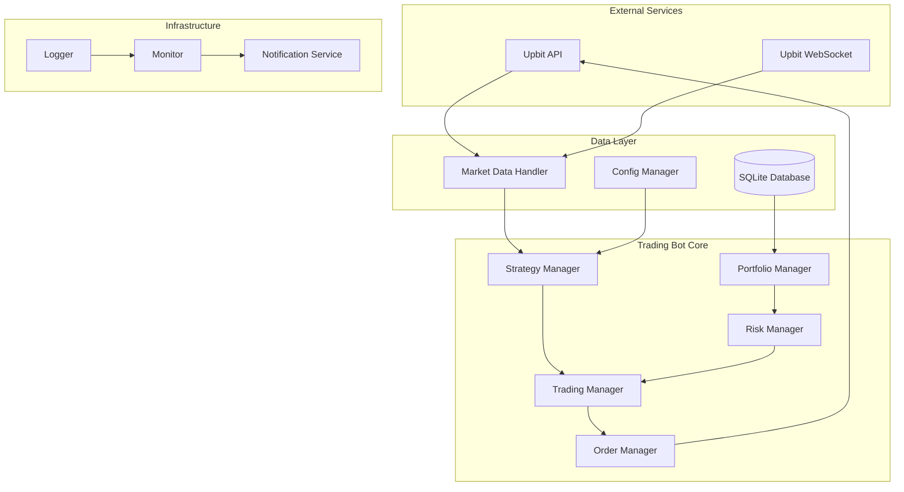

# Design Document

## Overview

업비트 자동매매 프로그램은 모듈화된 아키텍처를 통해 확장 가능하고 유지보수가 용이한 트레이딩 봇을 구현합니다. 시스템은 실시간 데이터 처리, 전략 실행, 리스크 관리, 주문 처리를 독립적인 컴포넌트로 분리하여 안정성과 성능을 보장합니다.

## Architecture



## Components and Interfaces

### 1. API Client (`api_client.py`)
업비트 API와의 모든 통신을 담당하는 클라이언트

```python
class UpbitAPIClient:
    def authenticate(self, access_key: str, secret_key: str) -> bool
    def get_accounts(self) -> List[Account]
    def get_ticker(self, market: str) -> Ticker
    def place_order(self, order: Order) -> OrderResult
    def cancel_order(self, order_id: str) -> bool
    def get_order_status(self, order_id: str) -> OrderStatus
```

### 2. Market Data Handler (`market_data.py`)
실시간 시장 데이터 수집 및 처리

```python
class MarketDataHandler:
    def start_websocket_connection(self, markets: List[str]) -> None
    def get_current_price(self, market: str) -> float
    def get_orderbook(self, market: str) -> OrderBook
    def get_price_history(self, market: str, period: int) -> DataFrame
    def subscribe_to_ticker(self, callback: Callable) -> None
```

### 3. Strategy Manager (`strategy_manager.py`)
트레이딩 전략 실행 및 관리

```python
class StrategyManager:
    def load_strategies(self, config_path: str) -> None
    def evaluate_strategies(self, market_data: MarketData) -> List[TradingSignal]
    def add_strategy(self, strategy: TradingStrategy) -> None
    def remove_strategy(self, strategy_id: str) -> None
```

### 4. Order Manager (`order_manager.py`)
주문 생성, 실행, 추적 관리

```python
class OrderManager:
    def create_order(self, signal: TradingSignal) -> Order
    def execute_order(self, order: Order) -> OrderResult
    def cancel_order(self, order_id: str) -> bool
    def track_orders(self) -> List[OrderStatus]
    def validate_order(self, order: Order) -> bool
```

### 5. Risk Manager (`risk_manager.py`)
리스크 관리 및 손실 제한

```python
class RiskManager:
    def check_position_limits(self, order: Order) -> bool
    def check_daily_limits(self) -> bool
    def calculate_stop_loss(self, position: Position) -> float
    def should_stop_trading(self) -> bool
    def get_max_order_size(self, market: str) -> float
```

## Data Models

### Core Data Structures

```python
@dataclass
class Ticker:
    market: str
    trade_price: float
    trade_volume: float
    timestamp: datetime
    change_rate: float

@dataclass
class Order:
    market: str
    side: str  # 'bid' or 'ask'
    ord_type: str  # 'limit' or 'market'
    price: Optional[float]
    volume: float
    identifier: Optional[str]

@dataclass
class TradingSignal:
    market: str
    action: str  # 'buy' or 'sell'
    confidence: float
    price: float
    volume: float
    strategy_id: str
    timestamp: datetime

@dataclass
class Position:
    market: str
    avg_buy_price: float
    balance: float
    locked: float
    unit_currency: str
```

### Database Schema

```sql
-- 거래 내역 테이블
CREATE TABLE trades (
    id BIGINT AUTO_INCREMENT PRIMARY KEY,
    market VARCHAR(20) NOT NULL,
    side ENUM('bid', 'ask') NOT NULL,
    price DECIMAL(20, 8) NOT NULL,
    volume DECIMAL(20, 8) NOT NULL,
    fee DECIMAL(20, 8) NOT NULL,
    timestamp DATETIME NOT NULL,
    strategy_id VARCHAR(50),
    INDEX idx_market_timestamp (market, timestamp),
    INDEX idx_strategy_timestamp (strategy_id, timestamp)
);

-- 포트폴리오 스냅샷 테이블
CREATE TABLE portfolio_snapshots (
    id BIGINT AUTO_INCREMENT PRIMARY KEY,
    total_krw DECIMAL(20, 8) NOT NULL,
    total_btc DECIMAL(20, 8) NOT NULL,
    timestamp DATETIME NOT NULL,
    positions JSON,  -- JSON 형태의 포지션 정보
    INDEX idx_timestamp (timestamp)
);

-- 설정 변경 이력 테이블
CREATE TABLE config_changes (
    id BIGINT AUTO_INCREMENT PRIMARY KEY,
    config_type VARCHAR(50) NOT NULL,
    old_value TEXT,
    new_value TEXT,
    timestamp DATETIME NOT NULL,
    INDEX idx_config_type_timestamp (config_type, timestamp)
);

-- 주문 이력 테이블
CREATE TABLE orders (
    id BIGINT AUTO_INCREMENT PRIMARY KEY,
    order_id VARCHAR(50) UNIQUE NOT NULL,
    market VARCHAR(20) NOT NULL,
    side ENUM('bid', 'ask') NOT NULL,
    ord_type ENUM('limit', 'market') NOT NULL,
    price DECIMAL(20, 8),
    volume DECIMAL(20, 8) NOT NULL,
    state ENUM('wait', 'done', 'cancel') NOT NULL,
    created_at DATETIME NOT NULL,
    updated_at DATETIME NOT NULL,
    INDEX idx_order_id (order_id),
    INDEX idx_market_created (market, created_at)
);
```
## Correctness Properties

*A property is a characteristic or behavior that should hold true across all valid executions of a system-essentially, a formal statement about what the system should do. Properties serve as the bridge between human-readable specifications and machine-verifiable correctness guarantees.*

### Authentication and Security Properties

**Property 1: API Authentication Success**
*For any* valid API key pair, authentication with Upbit API should succeed and return valid session credentials
**Validates: Requirements 1.1**

**Property 2: Credential Encryption Round Trip**
*For any* API credentials, encrypting then decrypting should produce the original credentials unchanged
**Validates: Requirements 1.4**

**Property 3: Authentication Header Consistency**
*For any* API request, the request should include properly formatted authentication headers with valid signatures
**Validates: Requirements 1.5**

**Property 4: Rate Limit Backoff Behavior**
*For any* API rate limit response, the system should implement exponential backoff with increasing delays between retries
**Validates: Requirements 1.3**

### Market Data Processing Properties

**Property 5: Market Data Parsing Consistency**
*For any* valid market data response, parsing should produce structured data with all required fields populated
**Validates: Requirements 2.2**

**Property 6: Rolling Window Maintenance**
*For any* sequence of price updates, the rolling window should maintain exactly the configured number of data points
**Validates: Requirements 2.4**

**Property 7: Data Update Performance**
*For any* new market data, internal data structures should be updated within the specified time limit of 100ms
**Validates: Requirements 2.5**

### Trading Strategy Properties

**Property 8: Strategy Independence**
*For any* set of configured strategies, each strategy evaluation should produce results independent of other strategies
**Validates: Requirements 3.2**

**Property 9: Signal Generation Consistency**
*For any* market conditions meeting strategy criteria, appropriate trading signals should be generated with correct parameters
**Validates: Requirements 3.1**

**Property 10: Configuration Loading Reliability**
*For any* valid YAML configuration file, all strategy parameters should be loaded correctly and applied to strategies
**Validates: Requirements 3.4, 7.1**

### Order Management Properties

**Property 11: Order Creation Accuracy**
*For any* valid trading signal, the created order should match the signal's market, side, and volume specifications
**Validates: Requirements 4.1**

**Property 12: Balance Validation Consistency**
*For any* order placement attempt, the system should validate sufficient balance before execution
**Validates: Requirements 4.2**

**Property 13: Order Retry Behavior**
*For any* failed order placement, the system should retry exactly 3 times with exponential backoff delays
**Validates: Requirements 4.3**

**Property 14: Portfolio Synchronization**
*For any* filled order, portfolio balances should be updated immediately to reflect the new state
**Validates: Requirements 4.4**

### Risk Management Properties

**Property 15: Stop Loss Trigger Accuracy**
*For any* portfolio state where losses exceed the configured stop-loss percentage, emergency sell orders should be triggered
**Validates: Requirements 5.1**

**Property 16: Volume Limit Enforcement**
*For any* trading session where daily volume exceeds configured limits, trading operations should be paused
**Validates: Requirements 5.2**

**Property 17: Balance Protection**
*For any* account state where balance falls below minimum threshold, new buy orders should be prevented
**Validates: Requirements 5.3**

### Data Persistence Properties

**Property 18: Trade Recording Completeness**
*For any* executed trade, all transaction details including timestamp, price, volume, and fees should be recorded
**Validates: Requirements 6.1**

**Property 19: Performance Metric Calculation**
*For any* trading history, calculated metrics (profit/loss, win rate, Sharpe ratio) should accurately reflect the trading performance
**Validates: Requirements 6.3**

**Property 20: Report Generation Consistency**
*For any* trading data set, generated JSON reports should contain all required fields and valid data
**Validates: Requirements 6.4**

### Configuration and Monitoring Properties

**Property 21: Configuration Hot Reload**
*For any* valid configuration change, the system should apply changes within 5 seconds without restart
**Validates: Requirements 7.3, 7.4**

**Property 22: Error Logging Completeness**
*For any* error condition, the system should log stack traces and sufficient context information for debugging
**Validates: Requirements 8.2**

**Property 23: Log Rotation Consistency**
*For any* daily operation, log files should be rotated and maintained for at least 30 days
**Validates: Requirements 8.3**

## Error Handling

### API Error Handling
- **Connection Failures**: Implement circuit breaker pattern with exponential backoff
- **Rate Limiting**: Respect API rate limits with intelligent queuing
- **Authentication Errors**: Secure credential refresh with fallback mechanisms
- **Data Validation**: Comprehensive input validation with detailed error messages

### Trading Error Handling
- **Insufficient Balance**: Graceful order rejection with clear messaging
- **Market Closure**: Automatic trading suspension during market downtime
- **Strategy Failures**: Isolated error handling to prevent cascade failures
- **Network Issues**: Robust retry mechanisms with timeout handling

### Data Error Handling
- **Corrupt Data**: Data validation with automatic recovery mechanisms
- **Database Errors**: Transaction rollback with data integrity preservation
- **Configuration Errors**: Validation with helpful error messages and defaults

## Testing Strategy

### Unit Testing Approach
- **Component Isolation**: Test each component independently with mocked dependencies
- **Edge Case Coverage**: Focus on boundary conditions and error scenarios
- **Integration Points**: Verify component interactions and data flow
- **Mock External Services**: Use mock Upbit API responses for consistent testing

### Property-Based Testing Approach
- **Framework**: Use `hypothesis` library for Python property-based testing
- **Test Configuration**: Run minimum 100 iterations per property test
- **Data Generation**: Create smart generators for market data, orders, and configurations
- **Property Validation**: Each correctness property implemented as single property-based test
- **Test Tagging**: Each property test tagged with format: '**Feature: upbit-trading-bot, Property {number}: {property_text}**'

### Testing Requirements
- Unit tests verify specific examples and integration points
- Property tests verify universal properties across all inputs
- Both approaches are complementary and provide comprehensive coverage
- Property tests catch general correctness issues, unit tests catch specific bugs
- All tests must run without external API dependencies using mocks and fixtures

### Test Data Management
- **Market Data Fixtures**: Pre-recorded market data for consistent testing
- **Configuration Templates**: Standard test configurations for various scenarios
- **Order Scenarios**: Comprehensive order test cases covering all order types
- **Error Simulation**: Systematic error injection for resilience testing